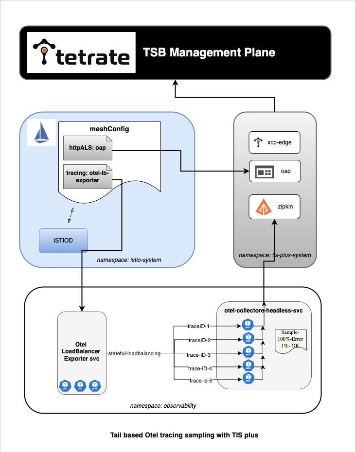

# Tail based otel sampling with multi endpoint trace exporting

This example runs -

- Otel collector operator in opentelemetry-operator-system namespace (default)
- Otel collector with tail sampling processor - Total pods(replicas)-5 , in observability namespace.
- Otel LoadBalancer Exporter - backend to otel collector[2],  in observability namespace.


## Step-1.  Install otel collector operator

```
kubectl apply -f https://github.com/open-telemetry/opentelemetry-operator/releases/latest/download/opentelemetry-operator.yaml
```

## Step-2.  Install LoadBalancer Exporter
and
## Step-3.  Install Otel collector with tail sampling processor
```
./install-otel.sh
```

## Step-4. Configure Istio meshConfig 
 
Configure existing istio with `tid-istio-values.yaml` 


### Otel tail based sampling processor- 
github https://github.com/open-telemetry/opentelemetry-collector-contrib/tree/main/processor/tailsamplingprocessor#probabilistic-sampling-processor-compared-to-the-tail-sampling-processor-with-the-probabilistic-policy

### Otel Elastic search exporter - 
https://github.com/open-telemetry/opentelemetry-collector-contrib/tree/main/exporter/elasticsearchexporter